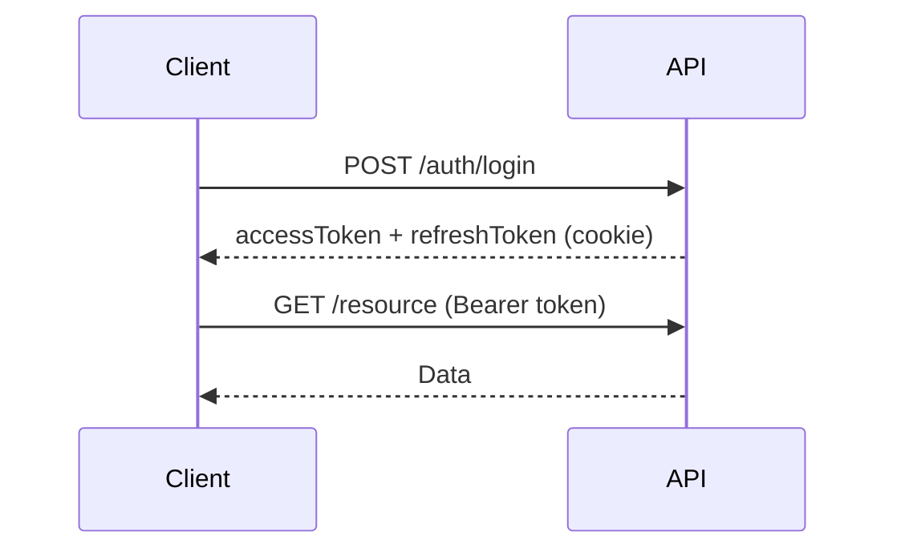
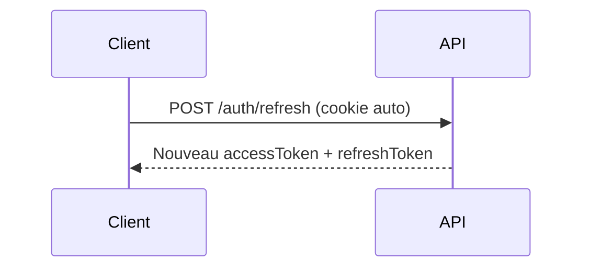
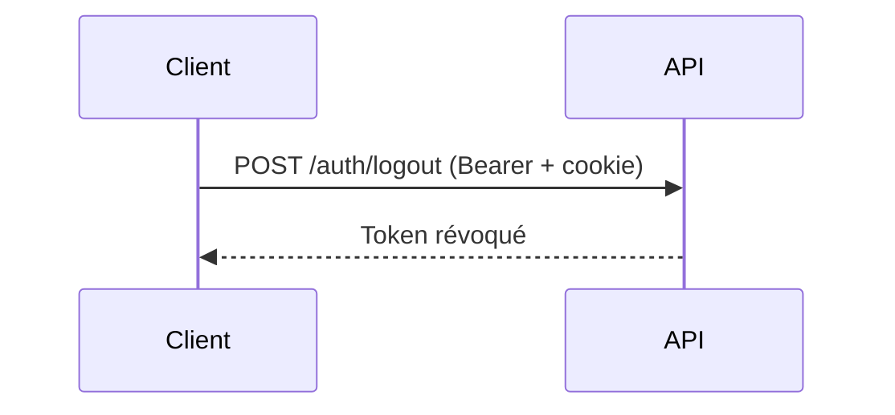

# 🔐 Authentication API

Documentation des endpoints d'authentification pour tous les utilisateurs.

**Base URL:** `http://localhost:4000/api/v1`

---

## 📑 Table des Matières

1. [Vue d'ensemble](#vue-densemble)
2. [Flux d'authentification](#flux-dauthentification)
3. [Endpoints](#endpoints)
   - [Login](#1-login)
   - [Refresh Token](#2-refresh-token)
   - [Logout](#3-logout)
   - [Logout All Devices](#4-logout-all-devices)
   - [Active Sessions](#5-active-sessions)
   - [Send Verification Code](#6-send-verification-code)
   - [Verify Phone](#7-verify-phone)
4. [Inscription Provider](#inscription-provider)
5. [Sécurité](#sécurité)

---

## Vue d'ensemble

### Mécanisme d'authentification

L'API utilise un système **JWT (JSON Web Token)** avec rotation de tokens :

| Token | Durée | Stockage | Usage |
|-------|-------|----------|-------|
| **Access Token** | 7 jours | Client (mémoire/storage) | Header `Authorization` |
| **Refresh Token** | 30 jours | Cookie HttpOnly | Renouvellement automatique |

### Rôles disponibles

| Rôle | Code | Description |
|------|------|-------------|
| Client | `client` | Utilisateur qui réserve des services |
| Provider | `provider` | Prestataire de services beauté |
| Admin | `admin` | Administrateur système |

---

## Flux d'authentification

### Connexion Standard



### Renouvellement de Token



### Déconnexion



---

## Endpoints

### 1. Login

Authentification avec phone/email et mot de passe.

**Endpoint:** `POST /auth/login`

**Auth Required:** ❌ Non

**Rate Limit:** 5 requêtes / minute

#### Request

```json
{
  "login": "+237655443322",
  "password": "Password123!"
}
```

| Champ | Type | Requis | Description |
|-------|------|--------|-------------|
| `login` | string | ✅ | Téléphone (+237XXXXXXXXX) ou email |
| `password` | string | ✅ | Mot de passe |

#### Validation du mot de passe

- Minimum 8 caractères
- Au moins 1 majuscule (A-Z)
- Au moins 1 minuscule (a-z)
- Au moins 1 chiffre (0-9)
- Au moins 1 caractère spécial (@$!%*?&)

#### Response Success (200)

```json
{
  "success": true,
  "message": "Opération réussie",
  "data": {
    "user": {
      "phone": "+237655443322",
      "role": "provider",
      "providerId": 3,
      "clientId": null
    },
    "accessToken": "eyJhbGciOiJIUzI1NiIsInR5cCI6IkpXVCJ9...",
    "expiresIn": 604800
  },
  "meta": {
    "timestamp": "2025-01-15T10:00:00.000Z",
    "path": "/api/v1/auth/login",
    "method": "POST",
    "duration": 45
  }
}
```

#### Response Errors

| Code | Status | Description |
|------|--------|-------------|
| `INVALID_CREDENTIALS` | 401 | Identifiants incorrects |
| `ACCOUNT_DISABLED` | 403 | Compte désactivé |
| `VALIDATION_ERROR` | 400 | Données invalides |

#### Exemple cURL

```bash
curl -X POST http://localhost:4000/api/v1/auth/login \
  -H "Content-Type: application/json" \
  -c cookies.txt \
  -d '{
    "login": "+237655443322",
    "password": "Password123!"
  }'
```

---

### 2. Refresh Token

Renouvelle l'access token en utilisant le refresh token (cookie).

**Endpoint:** `POST /auth/refresh`

**Auth Required:** ❌ Non (utilise le cookie)

#### Request

Aucun body requis. Le refresh token est lu depuis le cookie `refreshToken`.

#### Response Success (200)

```json
{
  "success": true,
  "data": {
    "accessToken": "eyJhbGciOiJIUzI1NiIsInR5cCI6IkpXVCJ9...",
    "expiresIn": 604800
  }
}
```

#### Response Errors

| Code | Status | Description |
|------|--------|-------------|
| `INVALID_REFRESH_TOKEN` | 401 | Token invalide ou expiré |
| `TOKEN_REVOKED` | 401 | Token révoqué |

#### Notes

- Le refresh token est automatiquement renouvelé (rotation)
- L'ancien refresh token est révoqué après utilisation
- Maximum 5 sessions actives par utilisateur

---

### 3. Logout

Déconnecte la session courante.

**Endpoint:** `POST /auth/logout`

**Auth Required:** ✅ Oui (Bearer Token)

#### Headers

```http
Authorization: Bearer <accessToken>
```

#### Response Success (200)

```json
{
  "success": true,
  "message": "Déconnexion réussie"
}
```

#### Notes

- Révoque le refresh token de la session courante
- Supprime le cookie `refreshToken`
- L'access token reste valide jusqu'à expiration (stateless)

---

### 4. Logout All Devices

Déconnecte toutes les sessions de l'utilisateur.

**Endpoint:** `POST /auth/logout-all`

**Auth Required:** ✅ Oui (Bearer Token)

#### Headers

```http
Authorization: Bearer <accessToken>
```

#### Response Success (200)

```json
{
  "success": true,
  "message": "Toutes les sessions ont été déconnectées",
  "data": {
    "revokedCount": 3
  }
}
```

#### Use Cases

- Changement de mot de passe
- Suspicion de compromission
- Nettoyage des sessions

---

### 5. Active Sessions

Liste les sessions actives de l'utilisateur.

**Endpoint:** `GET /auth/sessions`

**Auth Required:** ✅ Oui (Bearer Token)

#### Headers

```http
Authorization: Bearer <accessToken>
```

#### Response Success (200)

```json
{
  "success": true,
  "data": [
    {
      "id": 1,
      "deviceInfo": "Mozilla/5.0 (iPhone; CPU iPhone OS 17_0)",
      "ipAddress": "192.168.1.100",
      "createdAt": "2025-01-10T08:00:00.000Z",
      "lastUsedAt": "2025-01-15T10:30:00.000Z",
      "isCurrent": true
    },
    {
      "id": 2,
      "deviceInfo": "Mozilla/5.0 (Windows NT 10.0; Win64; x64)",
      "ipAddress": "192.168.1.101",
      "createdAt": "2025-01-08T14:00:00.000Z",
      "lastUsedAt": "2025-01-14T18:00:00.000Z",
      "isCurrent": false
    }
  ]
}
```

---

### 6. Send Verification Code

Envoie un code OTP par SMS pour vérifier le numéro de téléphone.

**Endpoint:** `POST /auth/send-verification-code`

**Auth Required:** ✅ Oui (Bearer Token)

**Rate Limit:** 3 requêtes / 5 minutes

#### Headers

```http
Authorization: Bearer <accessToken>
```

#### Request

```json
{
  "phone": "+237655443322"
}
```

#### Response Success (200)

```json
{
  "success": true,
  "message": "Code de vérification envoyé",
  "data": {
    "expiresIn": 300,
    "attemptsRemaining": 3
  }
}
```

#### Response Errors

| Code | Status | Description |
|------|--------|-------------|
| `TOO_MANY_ATTEMPTS` | 429 | Trop de demandes |
| `INVALID_PHONE` | 400 | Format téléphone invalide |

#### Notes

- Code valide 5 minutes
- Maximum 3 tentatives de vérification
- En mode développement, le code est loggé (pas d'envoi SMS réel)

---

### 7. Verify Phone

Vérifie le code OTP reçu par SMS.

**Endpoint:** `POST /auth/verify-phone`

**Auth Required:** ✅ Oui (Bearer Token)

**Rate Limit:** 5 requêtes / minute

#### Headers

```http
Authorization: Bearer <accessToken>
```

#### Request

```json
{
  "phone": "+237655443322",
  "code": "123456"
}
```

#### Response Success (200)

```json
{
  "success": true,
  "message": "Téléphone vérifié avec succès",
  "data": {
    "phoneVerifiedAt": "2025-01-15T10:35:00.000Z"
  }
}
```

#### Response Errors

| Code | Status | Description |
|------|--------|-------------|
| `INVALID_CODE` | 400 | Code incorrect |
| `CODE_EXPIRED` | 400 | Code expiré |
| `TOO_MANY_ATTEMPTS` | 429 | Trop de tentatives |

---

## Inscription Provider

L'inscription des providers se fait via un endpoint dédié.

**Endpoint:** `POST /providers/register`

**Auth Required:** ❌ Non

**Documentation complète:** [PROVIDER.md](./PROVIDER.md#inscription)

#### Request Rapide

```json
{
  "fullName": "Marie Dupont",
  "phone": "+237655443322",
  "password": "Password123!",
  "city": "Douala"
}
```

#### Villes disponibles

- `Douala`
- `Yaoundé`
- `Bafoussam`
- `Garoua`
- `Bamenda`

---

## Sécurité

### Bonnes Pratiques

1. **Stockage des tokens**
   - Access Token : Mémoire ou sessionStorage (jamais localStorage)
   - Refresh Token : Cookie HttpOnly (géré automatiquement)

2. **Renouvellement**
   - Implémenter un intercepteur pour refresh automatique sur 401
   - Ne pas exposer le refresh token côté client

3. **Déconnexion**
   - Appeler `/auth/logout` pour révoquer le refresh token
   - Supprimer l'access token de la mémoire

### Configuration des Cookies

```
Set-Cookie: refreshToken=<token>; 
  HttpOnly; 
  Secure; 
  SameSite=Strict; 
  Path=/api/v1/auth; 
  Max-Age=2592000
```

### JWT Payload

```json
{
  "sub": 123,
  "phone": "+237655443322",
  "role": "provider",
  "providerId": 3,
  "clientId": null,
  "iat": 1705312800,
  "exp": 1705917600
}
```

---

## 📊 Résumé

| Endpoint | Méthode | Auth | Rate Limit |
|----------|---------|------|------------|
| `/auth/login` | POST | ❌ | 5/min |
| `/auth/refresh` | POST | ❌ | - |
| `/auth/logout` | POST | ✅ | - |
| `/auth/logout-all` | POST | ✅ | - |
| `/auth/sessions` | GET | ✅ | - |
| `/auth/send-verification-code` | POST | ✅ | 3/5min |
| `/auth/verify-phone` | POST | ✅ | 5/min |

---

**Voir aussi:**
- [README.md](./README.md) - Index principal
- [COMMON.md](./COMMON.md) - Codes d'erreur et formats
